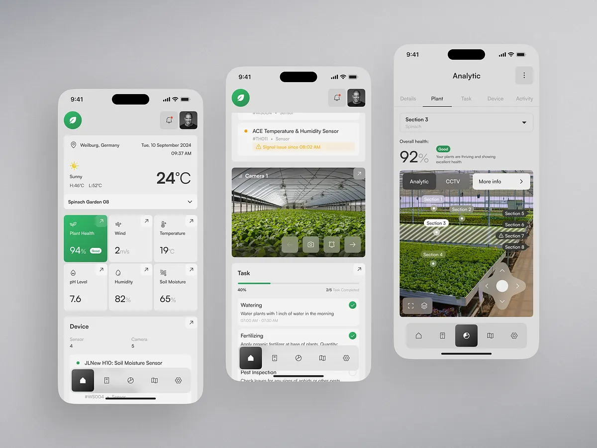

# 🌿 Cultivara

**Smart Agriculture, Refined.**\
Cultivara is a premium smart farming assistant that empowers agricultural stakeholders with real-time plant health analytics, environmental monitoring, and precision task management — all in one unified platform.

---

## 📸 Screenshot




---

## 🚀 Features

- 🌱 **Plant Health Monitoring**\
  Get real-time insights on plant vitality using sensor data and intelligent algorithms.

- 🌡️ **Environmental Metrics**\
  Track weather, temperature, humidity, soil moisture, and pH levels directly from the field.

- 📹 **Live Camera Integration**\
  Visualize farm sections with CCTV feeds and analytics overlays.

- 🗘️ **Interactive Field Mapping**\
  Navigate greenhouse sections with smart mapping and zone insights.

- ✅ **Task & Workflow Management**\
  Assign, track, and complete watering, fertilizing, and inspection tasks.

- 🔔 **Smart Alerts**\
  Get notified instantly about anomalies in sensors, weather, or plant health.

---

## 🧠 Tech Stack

- **Frontend:** Flutter (iOS & Android)
- **Backend:** Firebase (Firestore, Auth, Notifications)
- **Map & Sensor Layer:** Google Maps API, IoT Sensor Integrations
- **Analytics:** Custom algorithms for plant health & environment scoring
- **Hosting/Infra:** Firebase Hosting, optional admin via Next.js

---

## 🧪 Demo Access

> Coming Soon: Interactive demo access & downloadable APK

---

## 🛆 Installation (Dev Environment)

```bash
git clone https://github.com/jesse-jacks0n/Cultivara.git
cd cultivara
flutter pub get
flutter run
```

Ensure all API keys and `.env` configurations are set. Firebase setup required.

---

## 📁 Project Structure

```
lib/
├── screens/
├── widgets/
├── models/
├── services/
└── utils/
```

---

## 🧑‍💼 Use Cases

- Commercial greenhouse monitoring
- High-yield precision farming
- Smart agriculture research labs
- Institutional farm operations

---

## 📝 License

[MIT License](LICENSE)

---

## 🤝 Contributing

We welcome contributions to improve Cultivara! Please fork the repo, make your changes, and submit a pull request.

---

## 📬 Contact

For partnerships, inquiries or enterprise deployment:\
📧 [jesse](mailto\:amamjesse@gmail.com)\
🌐 [www.cultivara.agtech](https://www.cultivara.agtech) *(coming soon)*

---
